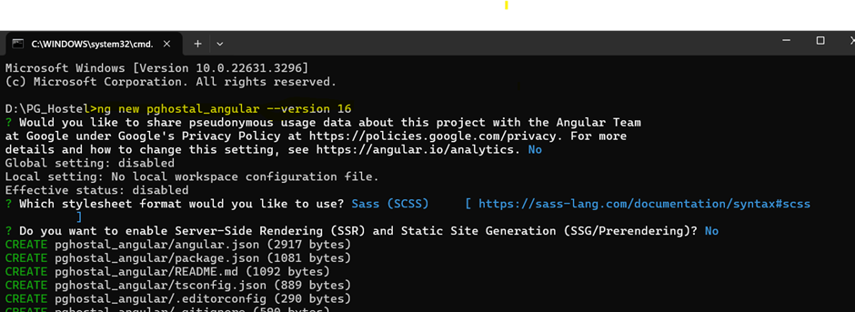
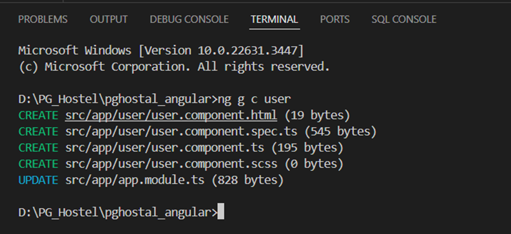
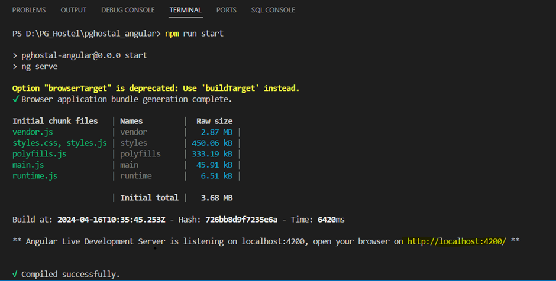
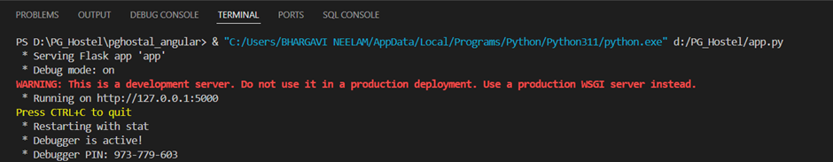
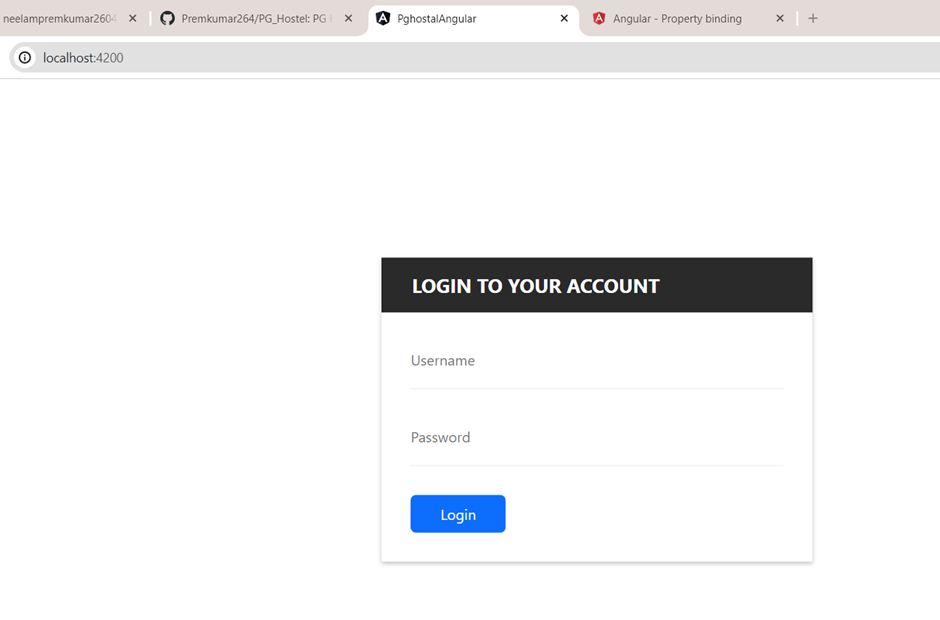
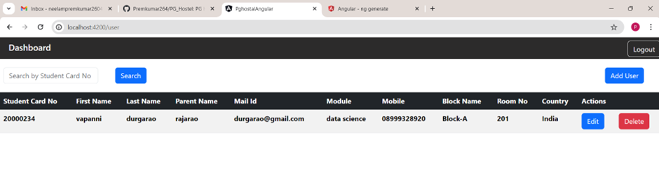
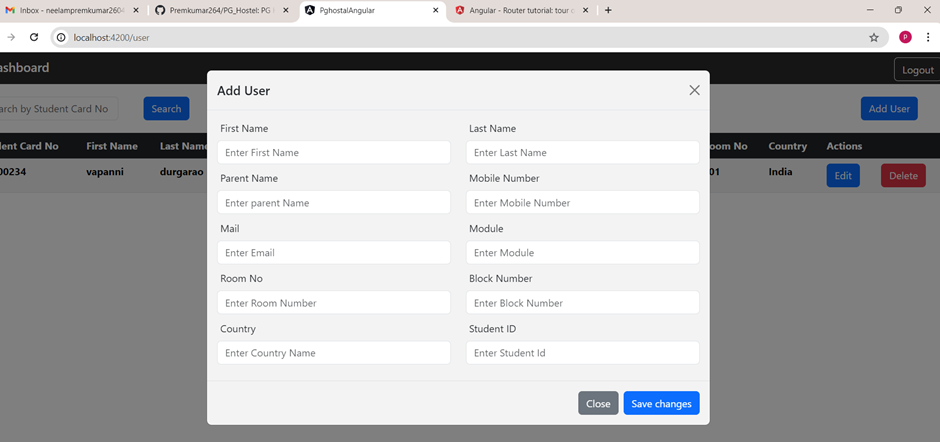
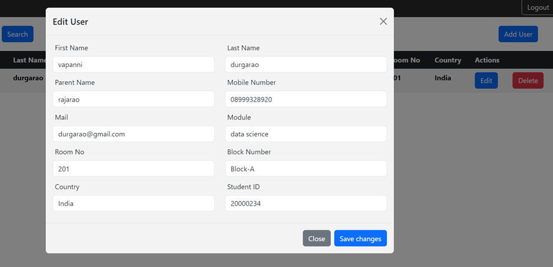

# PG Hostel
The PG Hostel Management System is a user-friendly web application designed to streamline the administrative tasks of managing a hostel for postgraduate students. With its intuitive interface and comprehensive features, hostel administrators can efficiently manage student records, facilitating smoother operations within the hostel.

### Key features

1. *Secure Admin Login*: Administrators can securely log in to the system using unique credentials, ensuring data privacy and security.
2. *Student Management*:
   - *Add Students*: Admins can easily add new students to the system by providing relevant details such as name, contact information, course details, and allocated room number.
   - *Edit Students*: Update student information as needed, including contact details, course changes, or room assignments.
   - *Delete Students*: Remove student records from the system when necessary, maintaining an accurate database.
3. *Search Functionality*:
   - *Search by Student ID*: Admins can quickly retrieve student information by searching for their unique student ID number. This feature enables efficient access to specific student records, saving time and effort.
4. *User-Friendly Interface*: The application boasts a user-friendly interface that makes navigation and operation intuitive for hostel administrators, minimizing the learning curve and optimizing productivity.

### Technologies Used

- *Frontend*: Angular
- *Backend*: Python Flask
- *Database*: PostgreSQL

# Angular CLI Documentation

## Installation

- ### Create a new project

## Code scaffolding

Run ng generate component component-name to generate a new component. You can also use ng generate directive|pipe|service|class|guard|interface|enum|module.

## Development server

Run ng serve for a dev server. Navigate to http://localhost:4200/. The application will automatically reload if you change any of the source files.

## Build

Run ng build to build the project. The build artifacts will be stored in the dist/ directory.

# Python flask Documentation

## Build

Run ng build to build the project. The build artifacts will be stored in the dist/ directory.

# Python flask Documentation

Screenshot of the application:

- 

# Reference
- https://nodejs.org/en
- https://angular.io/cli
- https://www.postgresql.org/docs/
- https://getbootstrap.com/

- YouTube reference: https://www.youtube.com/watch?v=K-D-VUEC_J8&list=PLAtyf1uTNHNWW3ualgrYQ7Jf8DiZ_ijha